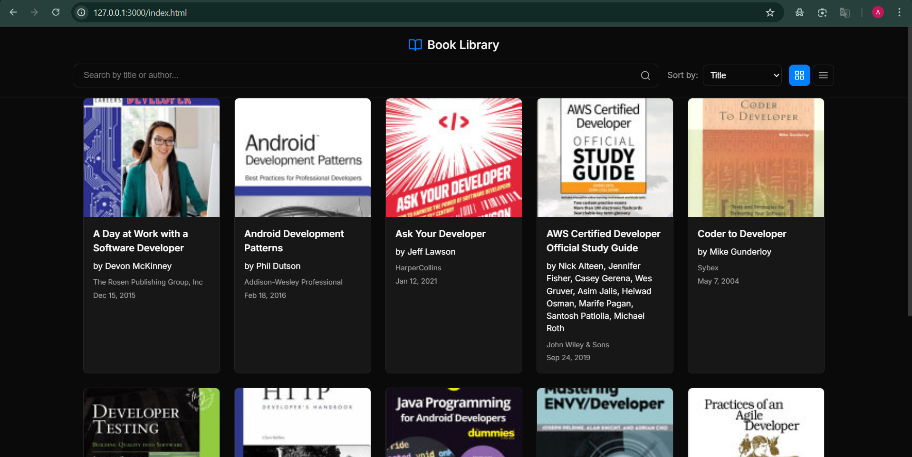

# Book Library

## Overview

A simple book library application that fetches and displays books with search, sort, and view toggling capabilities.

## Application Features

- Search for books by title or author.
- Sort books by title, published date, or author.
- Toggle between grid and list views.
- Responsive design for different screen sizes.

## Screenshots

## Deployment Link

Access the live application here: [Deployment Link](https://)

## How to Run

1. Clone the repository.
2. Open the project folder.
3. Open `index.html` in your browser.
